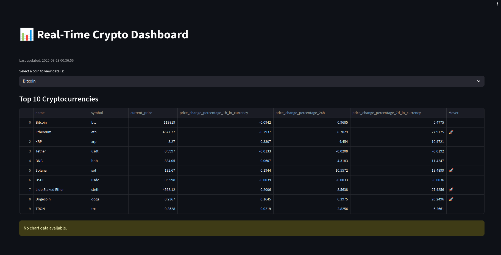

# Real-Time Crypto Dashboard with Streamlit & Power BI Integration

This project is a **real-time cryptocurrency dashboard** built with [Streamlit](https://streamlit.io/) that fetches live crypto market data from the [CoinGecko API](https://www.coingecko.com/en/api). It showcases dynamic visualizations and demonstrates how you can extend or integrate this dashboard with Microsoft Power BI for further business intelligence and reporting capabilities.

---

## Features

- Real-time updates of top cryptocurrencies by market cap and price.
- Interactive line and bar charts using Streamlit's built-in charting.
- Auto-refreshes data every minute without manual reload.
- Easy to deploy on Streamlit Cloud or your own server.
- Guidelines on how to embed this Streamlit app inside Power BI reports.
- Sample Python script for creating Python visuals directly in Power BI.

---

## Demo



---

## Getting Started

### Prerequisites

- Python 3.8+
- Streamlit (`pip install streamlit`)
- Requests library (`pip install requests`)

### Installation

1. Clone this repository:

   ```bash
   git clone https://github.com/AquaKnauf/Dashboard_demonstration.git
   cd crypto-dashboard
   ```

2. Install dependencies:

   ```bash
   pip install -r requirements.txt
   ```

3. Run the app locally:

   ```bash
   streamlit run crypto_dashboard.py
   ```

4. Open your browser at `http://localhost:8501` to view the dashboard.

---

## How to Embed in Power BI

You can integrate this Streamlit dashboard into Power BI reports using the **Web Content** visual:

1. Deploy your Streamlit app to a public URL (e.g., [Streamlit Cloud](https://share.streamlit.io/)).
2. In Power BI Desktop or Service, add the **Web Content** visual.
3. Paste your Streamlit app's URL.
4. Resize and position the visual within your report.

---

## Power BI Python Visuals

Alternatively, you can use Power BI's native Python visuals to replicate the dashboard's functionality:

```python
import pandas as pd
import matplotlib.pyplot as plt
import requests

url = "https://api.coingecko.com/api/v3/coins/markets"
params = {
    "vs_currency": "usd",
    "order": "market_cap_desc",
    "per_page": 10,
    "page": 1,
    "sparkline": "false"
}
response = requests.get(url, params=params).json()
df = pd.DataFrame(response)

df.plot(x="name", y="current_price", kind="bar", legend=False)
plt.ylabel('Price in USD')
plt.title('Top 10 Cryptocurrencies by Price')
plt.xticks(rotation=45)
plt.tight_layout()
plt.show()
```

---

## Future Enhancements

- Push live data directly to Power BI using Power BI REST API.
- Add user-selectable cryptocurrency filters.
- Incorporate more detailed financial metrics and news feeds.
- Support for authenticated dashboards with user login.

---

## License

MIT License — feel free to use and modify!

---

## Contact

Created by [AquaKnauf](https://github.com/AquaKnauf).  
Feel free to open issues or pull requests.

---
